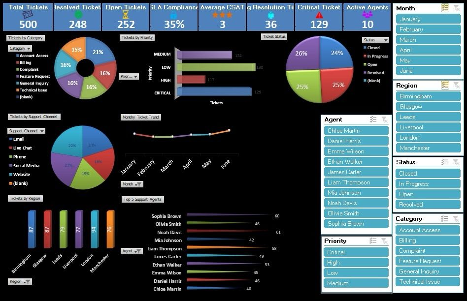

# Customer Support Performance Dashboard — Excel

## Project Overview

An interactive Excel dashboard designed to analyse customer support operations and present key performance information through KPI monitoring, trend analysis and data visualisation.

The dashboard provides an overview of ticket volumes, resolution performance, service-level performance, customer satisfaction and agent activity.

## Key Performance Indicators

- Total Tickets: 500
- Resolved Tickets: 248
- Open Tickets: 252
- SLA Compliance: 35%
- Average CSAT: 3
- Average Resolution Time: 36
- Critical Tickets: 129
- Active Agents: 10

## Analysis Included

- Tickets by Category
- Tickets by Priority
- Ticket Status
- Tickets by Support Channel
- Monthly Ticket Trends
- Tickets by Region
- Top 5 Support Agents
- Interactive filtering by Month, Region, Status, Category, Agent and Priority

## Skills Demonstrated

- Microsoft Excel
- KPI & Management Information Reporting
- Data Analysis
- Performance Monitoring
- Data Visualisation
- Trend Analysis
- Operational Reporting
- Interactive Dashboard Design

## Dashboard Preview

## Project Purpose

The dashboard demonstrates how operational support data can be transformed into concise management information to monitor performance, identify trends and support data-informed decision making.# excel-customer-support-performance-dashboard
Interactive Excel dashboard for customer support performance, KPI monitoring and management information.
